# Clarita - Documentacao do Banco de Dados

**Plataforma de Monitoramento de Saude Mental**
**Versao do Schema:** 1.0.0
**Banco de Dados:** PostgreSQL

---

## Indice

1. [Extensoes](#1-extensoes)
2. [Tipos Enum](#2-tipos-enum)
3. [Tabelas](#3-tabelas)
4. [Relacionamentos entre Tabelas](#4-relacionamentos-entre-tabelas)
5. [Triggers](#5-triggers)
6. [Diagrama ER (Mermaid)](#6-diagrama-er-mermaid)

---

## 1. Extensoes

O banco de dados utiliza duas extensoes do PostgreSQL:

| Extensao | Descricao |
|----------|-----------|
| `uuid-ossp` | Fornece funcoes para gerar UUIDs (Universally Unique Identifiers). Utilizada principalmente pela funcao `uuid_generate_v4()` para gerar chaves primarias automaticamente. |
| `pgcrypto` | Fornece funcoes criptograficas, incluindo `gen_random_uuid()` (usada em algumas tabelas de migracao) e funcoes de hashing para seguranca de dados sensiveis. |

---

## 2. Tipos Enum

O schema define os seguintes tipos enumerados:

### 2.1 `user_role`
Define os papeis de usuario na plataforma.

| Valor | Descricao |
|-------|-----------|
| `patient` | Paciente |
| `psychologist` | Psicologo(a) |
| `psychiatrist` | Psiquiatra |

### 2.2 `sleep_quality_level`
Niveis de qualidade de sono reportados pelo paciente.

| Valor | Descricao |
|-------|-----------|
| `very_poor` | Muito ruim |
| `poor` | Ruim |
| `fair` | Regular |
| `good` | Bom |
| `excellent` | Excelente |

### 2.3 `care_relationship_type`
Tipo do vinculo de cuidado entre paciente e profissional.

| Valor | Descricao |
|-------|-----------|
| `psychologist` | Psicologo(a) |
| `psychiatrist` | Psiquiatra |

### 2.4 `care_relationship_status`
Status do vinculo de cuidado.

| Valor | Descricao |
|-------|-----------|
| `active` | Ativo |
| `inactive` | Inativo |
| `pending` | Pendente (aguardando aceitacao) |

### 2.5 `data_permission_type`
Tipos de permissao de acesso a dados do paciente.

| Valor | Descricao |
|-------|-----------|
| `emotional_logs` | Registros emocionais |
| `symptoms` | Sintomas |
| `medications` | Medicacoes |
| `assessments` | Avaliacoes |
| `life_events` | Eventos de vida |
| `clinical_notes` | Notas clinicas |
| `journal_entries` | Entradas do diario (Phase 1) |
| `digital_twin` | Gemeo digital (Digital Twin) |
| `documents` | Documentos do paciente |
| `all` | Acesso total |

### 2.6 `medication_status`
Status de uma medicacao prescrita ao paciente.

| Valor | Descricao |
|-------|-----------|
| `active` | Ativa |
| `discontinued` | Descontinuada |
| `paused` | Pausada |

### 2.7 `life_event_category`
Categorias de eventos de vida significativos.

| Valor | Descricao |
|-------|-----------|
| `relationship` | Relacionamento |
| `work` | Trabalho |
| `health` | Saude |
| `family` | Familia |
| `financial` | Financeiro |
| `loss` | Perda |
| `achievement` | Conquista |
| `other` | Outro |

### 2.8 `clinical_note_type`
Tipos de notas clinicas.

| Valor | Descricao |
|-------|-----------|
| `session` | Sessao |
| `observation` | Observacao |
| `treatment_plan` | Plano de tratamento |
| `progress` | Progresso |

### 2.9 `ai_insight_type`
Tipos de insights gerados pela IA.

| Valor | Descricao |
|-------|-----------|
| `pattern` | Padrao identificado |
| `correlation` | Correlacao |
| `anomaly` | Anomalia |
| `trend` | Tendencia |
| `risk` | Risco |

### 2.10 `impact_level`
Nivel de impacto de um insight da IA.

| Valor | Descricao |
|-------|-----------|
| `low` | Baixo |
| `medium` | Medio |
| `high` | Alto |
| `critical` | Critico |

### 2.11 `alert_type`
Tipos de alertas gerados pelo sistema.

| Valor | Descricao |
|-------|-----------|
| `depressive_episode` | Episodio depressivo |
| `high_anxiety` | Ansiedade elevada |
| `medication_non_adherence` | Nao adesao a medicacao |
| `risk_pattern` | Padrao de risco |
| `anomaly` | Anomalia detectada |
| `new_exam` | Novo exame enviado (Migration Exams) |
| `goal_rejected` | Meta recusada pelo paciente (Goal Acceptance) |

### 2.12 `alert_severity`
Niveis de severidade dos alertas.

| Valor | Descricao |
|-------|-----------|
| `low` | Baixo |
| `medium` | Medio |
| `high` | Alto |
| `critical` | Critico |

### 2.13 `goal_status`
Status de uma meta do paciente.

| Valor | Descricao |
|-------|-----------|
| `in_progress` | Em andamento |
| `achieved` | Alcancada |
| `paused` | Pausada |
| `cancelled` | Cancelada |

---

## 3. Tabelas

### 3.1 `users`

Tabela principal de usuarios do sistema (pacientes, psicologos e psiquiatras).

| Coluna | Tipo | Restricoes | Descricao |
|--------|------|------------|-----------|
| `id` | UUID | PK, DEFAULT `uuid_generate_v4()` | Identificador unico |
| `email` | VARCHAR(255) | NOT NULL, UNIQUE (`uq_users_email`) | Email do usuario |
| `password_hash` | VARCHAR(255) | NOT NULL | Hash da senha |
| `role` | `user_role` | NOT NULL | Papel do usuario |
| `first_name` | VARCHAR(100) | NOT NULL | Primeiro nome |
| `last_name` | VARCHAR(100) | NOT NULL | Sobrenome |
| `phone` | VARCHAR(30) | - | Telefone |
| `avatar_url` | TEXT | - | URL da foto de perfil |
| `is_active` | BOOLEAN | NOT NULL, DEFAULT TRUE | Se o usuario esta ativo |
| `email_verified` | BOOLEAN | NOT NULL, DEFAULT FALSE | Se o email foi verificado |
| `display_id` | VARCHAR(12) | NOT NULL, UNIQUE (`idx_users_display_id`) | ID de exibicao (ex: CLA-A1B2C3) |
| `reset_token` | VARCHAR(255) | - | Token de redefinicao de senha |
| `reset_token_expires` | TIMESTAMPTZ | - | Expiracao do token de redefinicao |
| `created_at` | TIMESTAMPTZ | NOT NULL, DEFAULT NOW() | Data de criacao |
| `updated_at` | TIMESTAMPTZ | NOT NULL, DEFAULT NOW() | Data de atualizacao |

**Indices:**

| Nome | Colunas | Observacao |
|------|---------|------------|
| `idx_users_role` | `role` | |
| `idx_users_email` | `email` | |
| `idx_users_is_active` | `is_active` | |
| `idx_users_created_at` | `created_at` | |
| `idx_users_display_id` | `display_id` | UNIQUE |
| `idx_users_reset_token` | `reset_token` | Parcial: WHERE `reset_token IS NOT NULL` |

---

### 3.2 `patient_profiles`

Perfil detalhado do paciente, vinculado 1:1 com `users`.

| Coluna | Tipo | Restricoes | Descricao |
|--------|------|------------|-----------|
| `id` | UUID | PK, DEFAULT `uuid_generate_v4()` | Identificador unico |
| `user_id` | UUID | NOT NULL, FK -> `users(id)` ON DELETE CASCADE, UNIQUE | Referencia ao usuario |
| `date_of_birth` | DATE | - | Data de nascimento |
| `gender` | VARCHAR(30) | - | Genero |
| `emergency_contact_name` | VARCHAR(200) | - | Nome do contato de emergencia |
| `emergency_contact_phone` | VARCHAR(30) | - | Telefone do contato de emergencia |
| `onboarding_completed` | BOOLEAN | NOT NULL, DEFAULT FALSE | Se o onboarding foi concluido |
| `onboarding_data` | JSONB | DEFAULT '{}' | Dados do onboarding |
| `created_at` | TIMESTAMPTZ | NOT NULL, DEFAULT NOW() | Data de criacao |
| `updated_at` | TIMESTAMPTZ | NOT NULL, DEFAULT NOW() | Data de atualizacao |

**Indices:**

| Nome | Colunas |
|------|---------|
| `idx_patient_profiles_user_id` | `user_id` |

---

### 3.3 `professional_profiles`

Perfil do profissional de saude mental, vinculado 1:1 com `users`.

| Coluna | Tipo | Restricoes | Descricao |
|--------|------|------------|-----------|
| `id` | UUID | PK, DEFAULT `uuid_generate_v4()` | Identificador unico |
| `user_id` | UUID | NOT NULL, FK -> `users(id)` ON DELETE CASCADE, UNIQUE | Referencia ao usuario |
| `license_number` | VARCHAR(100) | NOT NULL, UNIQUE (`uq_professional_profiles_license`) | Numero do registro profissional (CRP/CRM) |
| `specialization` | VARCHAR(200) | - | Especializacao |
| `institution` | VARCHAR(300) | - | Instituicao |
| `bio` | TEXT | - | Biografia |
| `years_of_experience` | INTEGER | CHECK >= 0 | Anos de experiencia |
| `created_at` | TIMESTAMPTZ | NOT NULL, DEFAULT NOW() | Data de criacao |
| `updated_at` | TIMESTAMPTZ | NOT NULL, DEFAULT NOW() | Data de atualizacao |

**Indices:**

| Nome | Colunas |
|------|---------|
| `idx_professional_profiles_user_id` | `user_id` |
| `idx_professional_profiles_license` | `license_number` |

---

### 3.4 `care_relationships`

Vinculos de cuidado entre pacientes e profissionais. Inclui fluxo de convite.

| Coluna | Tipo | Restricoes | Descricao |
|--------|------|------------|-----------|
| `id` | UUID | PK, DEFAULT `uuid_generate_v4()` | Identificador unico |
| `patient_id` | UUID | NOT NULL, FK -> `users(id)` ON DELETE CASCADE | Paciente |
| `professional_id` | UUID | NOT NULL, FK -> `users(id)` ON DELETE CASCADE | Profissional |
| `relationship_type` | `care_relationship_type` | NOT NULL | Tipo (psicologo/psiquiatra) |
| `status` | `care_relationship_status` | NOT NULL, DEFAULT 'pending' | Status do vinculo |
| `started_at` | TIMESTAMPTZ | - | Inicio do vinculo |
| `ended_at` | TIMESTAMPTZ | CHECK `ended_at >= started_at` | Fim do vinculo |
| `invited_by` | UUID | FK -> `users(id)` | Quem enviou o convite |
| `invitation_message` | TEXT | - | Mensagem do convite |
| `responded_at` | TIMESTAMPTZ | - | Quando o convite foi respondido |
| `created_at` | TIMESTAMPTZ | NOT NULL, DEFAULT NOW() | Data de criacao |
| `updated_at` | TIMESTAMPTZ | NOT NULL, DEFAULT NOW() | Data de atualizacao |

**Constraints adicionais:**
- `chk_care_relationships_different_users`: `patient_id <> professional_id` (paciente e profissional devem ser diferentes)
- `chk_care_relationships_dates`: `ended_at IS NULL OR ended_at >= started_at`
- `idx_care_relationships_unique_active`: UNIQUE parcial em `(patient_id, professional_id)` WHERE `status IN ('active', 'pending')` -- apenas um vinculo ativo/pendente por par

**Indices:**

| Nome | Colunas | Observacao |
|------|---------|------------|
| `idx_care_relationships_patient_id` | `patient_id` | |
| `idx_care_relationships_professional_id` | `professional_id` | |
| `idx_care_relationships_status` | `status` | |
| `idx_care_relationships_patient_status` | `patient_id, status` | |
| `idx_care_relationships_professional_status` | `professional_id, status` | |
| `idx_care_relationships_pending_patient` | `patient_id, status` | Parcial: WHERE `status = 'pending'` |
| `idx_care_relationships_pending_professional` | `professional_id, status` | Parcial: WHERE `status = 'pending'` |
| `idx_care_relationships_unique_active` | `patient_id, professional_id` | UNIQUE parcial: WHERE `status IN ('active', 'pending')` |

---

### 3.5 `data_permissions`

Permissoes de acesso a dados do paciente por profissional.

| Coluna | Tipo | Restricoes | Descricao |
|--------|------|------------|-----------|
| `id` | UUID | PK, DEFAULT `uuid_generate_v4()` | Identificador unico |
| `patient_id` | UUID | NOT NULL, FK -> `users(id)` ON DELETE CASCADE | Paciente |
| `professional_id` | UUID | NOT NULL, FK -> `users(id)` ON DELETE CASCADE | Profissional |
| `permission_type` | `data_permission_type` | NOT NULL | Tipo de dado permitido |
| `granted` | BOOLEAN | NOT NULL, DEFAULT FALSE | Se a permissao esta concedida |
| `created_at` | TIMESTAMPTZ | NOT NULL, DEFAULT NOW() | Data de criacao |
| `updated_at` | TIMESTAMPTZ | NOT NULL, DEFAULT NOW() | Data de atualizacao |

**Constraints adicionais:**
- `uq_data_permissions_patient_professional_type`: UNIQUE em `(patient_id, professional_id, permission_type)`
- `chk_data_permissions_different_users`: `patient_id <> professional_id`

**Indices:**

| Nome | Colunas |
|------|---------|
| `idx_data_permissions_patient_id` | `patient_id` |
| `idx_data_permissions_professional_id` | `professional_id` |
| `idx_data_permissions_patient_professional` | `patient_id, professional_id` |

---

### 3.6 `emotional_logs`

Registros emocionais diarios do paciente, incluindo humor, ansiedade, energia, sono e diario.

| Coluna | Tipo | Restricoes | Descricao |
|--------|------|------------|-----------|
| `id` | UUID | PK, DEFAULT `uuid_generate_v4()` | Identificador unico |
| `patient_id` | UUID | NOT NULL, FK -> `users(id)` ON DELETE CASCADE | Paciente |
| `mood_score` | INTEGER | NOT NULL, CHECK 1-10 | Pontuacao de humor (1 a 10) |
| `anxiety_score` | INTEGER | NOT NULL, CHECK 1-10 | Pontuacao de ansiedade (1 a 10) |
| `energy_score` | INTEGER | NOT NULL, CHECK 1-10 | Pontuacao de energia (1 a 10) |
| `sleep_quality` | `sleep_quality_level` | - | Qualidade do sono |
| `sleep_hours` | DECIMAL(4,2) | CHECK 0-24 | Horas de sono |
| `notes` | TEXT | - | Observacoes |
| `journal_entry` | TEXT | - | Entrada do diario (Phase 1) |
| `logged_at` | TIMESTAMPTZ | NOT NULL, DEFAULT NOW() | Data/hora do registro |
| `created_at` | TIMESTAMPTZ | NOT NULL, DEFAULT NOW() | Data de criacao |

**Indices:**

| Nome | Colunas |
|------|---------|
| `idx_emotional_logs_patient_id` | `patient_id` |
| `idx_emotional_logs_logged_at` | `logged_at` |
| `idx_emotional_logs_patient_logged` | `patient_id, logged_at DESC` |
| `idx_emotional_logs_created_at` | `created_at` |

---

### 3.7 `symptoms`

Catalogo de sintomas disponiveis no sistema.

| Coluna | Tipo | Restricoes | Descricao |
|--------|------|------------|-----------|
| `id` | UUID | PK, DEFAULT `uuid_generate_v4()` | Identificador unico |
| `name` | VARCHAR(200) | NOT NULL, UNIQUE (`uq_symptoms_name`) | Nome do sintoma |
| `category` | VARCHAR(100) | NOT NULL | Categoria |
| `description` | TEXT | - | Descricao |
| `severity_scale` | VARCHAR(100) | - | Escala de severidade |
| `created_at` | TIMESTAMPTZ | NOT NULL, DEFAULT NOW() | Data de criacao |

**Indices:**

| Nome | Colunas |
|------|---------|
| `idx_symptoms_category` | `category` |
| `idx_symptoms_name` | `name` |

---

### 3.8 `patient_symptoms`

Sintomas reportados por pacientes, com severidade.

| Coluna | Tipo | Restricoes | Descricao |
|--------|------|------------|-----------|
| `id` | UUID | PK, DEFAULT `uuid_generate_v4()` | Identificador unico |
| `patient_id` | UUID | NOT NULL, FK -> `users(id)` ON DELETE CASCADE | Paciente |
| `symptom_id` | UUID | NOT NULL, FK -> `symptoms(id)` ON DELETE CASCADE | Sintoma |
| `severity` | INTEGER | NOT NULL, CHECK 1-10 | Severidade (1 a 10) |
| `notes` | TEXT | - | Observacoes |
| `reported_at` | TIMESTAMPTZ | NOT NULL, DEFAULT NOW() | Data/hora do relato |
| `created_at` | TIMESTAMPTZ | NOT NULL, DEFAULT NOW() | Data de criacao |

**Indices:**

| Nome | Colunas |
|------|---------|
| `idx_patient_symptoms_patient_id` | `patient_id` |
| `idx_patient_symptoms_symptom_id` | `symptom_id` |
| `idx_patient_symptoms_reported_at` | `reported_at` |
| `idx_patient_symptoms_patient_reported` | `patient_id, reported_at DESC` |

---

### 3.9 `medications`

Catalogo de medicacoes disponiveis.

| Coluna | Tipo | Restricoes | Descricao |
|--------|------|------------|-----------|
| `id` | UUID | PK, DEFAULT `uuid_generate_v4()` | Identificador unico |
| `name` | VARCHAR(200) | NOT NULL, UNIQUE (`uq_medications_name`) | Nome da medicacao |
| `category` | VARCHAR(100) | NOT NULL | Categoria |
| `description` | TEXT | - | Descricao |
| `common_dosages` | TEXT[] | - | Dosagens comuns (array) |
| `side_effects` | TEXT[] | - | Efeitos colaterais (array) |
| `created_at` | TIMESTAMPTZ | NOT NULL, DEFAULT NOW() | Data de criacao |

**Indices:**

| Nome | Colunas |
|------|---------|
| `idx_medications_category` | `category` |
| `idx_medications_name` | `name` |

---

### 3.10 `patient_medications`

Medicacoes prescritas/em uso por pacientes.

| Coluna | Tipo | Restricoes | Descricao |
|--------|------|------------|-----------|
| `id` | UUID | PK, DEFAULT `uuid_generate_v4()` | Identificador unico |
| `patient_id` | UUID | NOT NULL, FK -> `users(id)` ON DELETE CASCADE | Paciente |
| `medication_id` | UUID | NOT NULL, FK -> `medications(id)` ON DELETE RESTRICT | Medicacao |
| `prescribed_by` | UUID | FK -> `users(id)` ON DELETE SET NULL | Profissional prescritor |
| `dosage` | VARCHAR(100) | NOT NULL | Dosagem |
| `frequency` | VARCHAR(100) | NOT NULL | Frequencia |
| `start_date` | DATE | NOT NULL | Data de inicio |
| `end_date` | DATE | CHECK `end_date >= start_date` | Data de termino |
| `status` | `medication_status` | NOT NULL, DEFAULT 'active' | Status |
| `notes` | TEXT | - | Observacoes |
| `created_at` | TIMESTAMPTZ | NOT NULL, DEFAULT NOW() | Data de criacao |
| `updated_at` | TIMESTAMPTZ | NOT NULL, DEFAULT NOW() | Data de atualizacao |

**Indices:**

| Nome | Colunas |
|------|---------|
| `idx_patient_medications_patient_id` | `patient_id` |
| `idx_patient_medications_medication_id` | `medication_id` |
| `idx_patient_medications_prescribed_by` | `prescribed_by` |
| `idx_patient_medications_status` | `status` |
| `idx_patient_medications_patient_status` | `patient_id, status` |

---

### 3.11 `medication_logs`

Registros de tomada (ou nao) de medicacao pelo paciente.

| Coluna | Tipo | Restricoes | Descricao |
|--------|------|------------|-----------|
| `id` | UUID | PK, DEFAULT `uuid_generate_v4()` | Identificador unico |
| `patient_medication_id` | UUID | NOT NULL, FK -> `patient_medications(id)` ON DELETE CASCADE | Prescricao de medicacao |
| `taken_at` | TIMESTAMPTZ | NOT NULL, DEFAULT NOW() | Data/hora da tomada |
| `skipped` | BOOLEAN | NOT NULL, DEFAULT FALSE | Se foi pulada |
| `skip_reason` | TEXT | CHECK: obrigatorio se `skipped = TRUE` | Motivo de ter pulado |
| `notes` | TEXT | - | Observacoes |
| `created_at` | TIMESTAMPTZ | NOT NULL, DEFAULT NOW() | Data de criacao |

**Constraint adicional:**
- `chk_medication_logs_skip_reason`: se `skipped = TRUE`, `skip_reason` nao pode ser NULL

**Indices:**

| Nome | Colunas |
|------|---------|
| `idx_medication_logs_patient_medication_id` | `patient_medication_id` |
| `idx_medication_logs_taken_at` | `taken_at` |
| `idx_medication_logs_patient_medication_taken` | `patient_medication_id, taken_at DESC` |

---

### 3.12 `assessments`

Catalogo de avaliacoes/questionarios padronizados (ex: PHQ-9, GAD-7).

| Coluna | Tipo | Restricoes | Descricao |
|--------|------|------------|-----------|
| `id` | UUID | PK, DEFAULT `uuid_generate_v4()` | Identificador unico |
| `name` | VARCHAR(200) | NOT NULL, UNIQUE (`uq_assessments_name`) | Nome da avaliacao |
| `description` | TEXT | - | Descricao |
| `questions` | JSONB | NOT NULL | Perguntas (formato JSON) |
| `scoring_rules` | JSONB | NOT NULL | Regras de pontuacao (formato JSON) |
| `created_at` | TIMESTAMPTZ | NOT NULL, DEFAULT NOW() | Data de criacao |

**Indices:**

| Nome | Colunas |
|------|---------|
| `idx_assessments_name` | `name` |

---

### 3.13 `assessment_results`

Resultados das avaliacoes respondidas pelos pacientes.

| Coluna | Tipo | Restricoes | Descricao |
|--------|------|------------|-----------|
| `id` | UUID | PK, DEFAULT `uuid_generate_v4()` | Identificador unico |
| `patient_id` | UUID | NOT NULL, FK -> `users(id)` ON DELETE CASCADE | Paciente |
| `assessment_id` | UUID | NOT NULL, FK -> `assessments(id)` ON DELETE RESTRICT | Avaliacao |
| `answers` | JSONB | NOT NULL | Respostas (formato JSON) |
| `total_score` | INTEGER | NOT NULL, CHECK >= 0 | Pontuacao total |
| `severity_level` | VARCHAR(50) | NOT NULL | Nivel de severidade |
| `completed_at` | TIMESTAMPTZ | NOT NULL, DEFAULT NOW() | Data/hora de conclusao |
| `created_at` | TIMESTAMPTZ | NOT NULL, DEFAULT NOW() | Data de criacao |

**Indices:**

| Nome | Colunas |
|------|---------|
| `idx_assessment_results_patient_id` | `patient_id` |
| `idx_assessment_results_assessment_id` | `assessment_id` |
| `idx_assessment_results_completed_at` | `completed_at` |
| `idx_assessment_results_patient_completed` | `patient_id, completed_at DESC` |
| `idx_assessment_results_patient_assessment` | `patient_id, assessment_id` |

---

### 3.14 `life_events`

Eventos de vida significativos reportados pelo paciente.

| Coluna | Tipo | Restricoes | Descricao |
|--------|------|------------|-----------|
| `id` | UUID | PK, DEFAULT `uuid_generate_v4()` | Identificador unico |
| `patient_id` | UUID | NOT NULL, FK -> `users(id)` ON DELETE CASCADE | Paciente |
| `title` | VARCHAR(300) | NOT NULL | Titulo do evento |
| `description` | TEXT | - | Descricao |
| `category` | `life_event_category` | NOT NULL | Categoria |
| `impact_level` | INTEGER | NOT NULL, CHECK 1-10 | Nivel de impacto (1 a 10) |
| `event_date` | DATE | NOT NULL | Data do evento |
| `created_at` | TIMESTAMPTZ | NOT NULL, DEFAULT NOW() | Data de criacao |

**Indices:**

| Nome | Colunas |
|------|---------|
| `idx_life_events_patient_id` | `patient_id` |
| `idx_life_events_event_date` | `event_date` |
| `idx_life_events_category` | `category` |
| `idx_life_events_patient_date` | `patient_id, event_date DESC` |

---

### 3.15 `clinical_notes`

Notas clinicas escritas por profissionais sobre seus pacientes.

| Coluna | Tipo | Restricoes | Descricao |
|--------|------|------------|-----------|
| `id` | UUID | PK, DEFAULT `uuid_generate_v4()` | Identificador unico |
| `professional_id` | UUID | NOT NULL, FK -> `users(id)` ON DELETE CASCADE | Profissional autor |
| `patient_id` | UUID | NOT NULL, FK -> `users(id)` ON DELETE CASCADE | Paciente |
| `session_date` | DATE | NOT NULL | Data da sessao |
| `note_type` | `clinical_note_type` | NOT NULL | Tipo da nota |
| `content` | TEXT | NOT NULL | Conteudo da nota |
| `is_private` | BOOLEAN | NOT NULL, DEFAULT FALSE | Se e uma nota privada |
| `created_at` | TIMESTAMPTZ | NOT NULL, DEFAULT NOW() | Data de criacao |
| `updated_at` | TIMESTAMPTZ | NOT NULL, DEFAULT NOW() | Data de atualizacao |

**Constraint adicional:**
- `chk_clinical_notes_different_users`: `professional_id <> patient_id`

**Indices:**

| Nome | Colunas |
|------|---------|
| `idx_clinical_notes_professional_id` | `professional_id` |
| `idx_clinical_notes_patient_id` | `patient_id` |
| `idx_clinical_notes_session_date` | `session_date` |
| `idx_clinical_notes_note_type` | `note_type` |
| `idx_clinical_notes_patient_session` | `patient_id, session_date DESC` |
| `idx_clinical_notes_professional_patient` | `professional_id, patient_id` |

---

### 3.16 `ai_insights`

Insights gerados pela inteligencia artificial a partir dos dados do paciente.

| Coluna | Tipo | Restricoes | Descricao |
|--------|------|------------|-----------|
| `id` | UUID | PK, DEFAULT `uuid_generate_v4()` | Identificador unico |
| `patient_id` | UUID | NOT NULL, FK -> `users(id)` ON DELETE CASCADE | Paciente |
| `insight_type` | `ai_insight_type` | NOT NULL | Tipo do insight |
| `title` | VARCHAR(300) | NOT NULL | Titulo |
| `explanation` | TEXT | NOT NULL | Explicacao detalhada |
| `confidence_score` | DECIMAL(5,4) | NOT NULL, CHECK 0.0-1.0 | Score de confianca (0 a 1) |
| `impact_level` | `impact_level` | NOT NULL | Nivel de impacto |
| `data_points` | JSONB | DEFAULT '{}' | Pontos de dados utilizados |
| `recommendations` | TEXT | - | Recomendacoes |
| `is_reviewed` | BOOLEAN | NOT NULL, DEFAULT FALSE | Se foi revisado por profissional |
| `reviewed_by` | UUID | FK -> `users(id)` ON DELETE SET NULL | Profissional revisor |
| `created_at` | TIMESTAMPTZ | NOT NULL, DEFAULT NOW() | Data de criacao |

**Indices:**

| Nome | Colunas |
|------|---------|
| `idx_ai_insights_patient_id` | `patient_id` |
| `idx_ai_insights_insight_type` | `insight_type` |
| `idx_ai_insights_impact_level` | `impact_level` |
| `idx_ai_insights_is_reviewed` | `is_reviewed` |
| `idx_ai_insights_created_at` | `created_at` |
| `idx_ai_insights_patient_created` | `patient_id, created_at DESC` |

---

### 3.17 `alerts`

Alertas gerados pelo sistema para profissionais e pacientes.

| Coluna | Tipo | Restricoes | Descricao |
|--------|------|------------|-----------|
| `id` | UUID | PK, DEFAULT `uuid_generate_v4()` | Identificador unico |
| `patient_id` | UUID | NOT NULL, FK -> `users(id)` ON DELETE CASCADE | Paciente |
| `alert_type` | `alert_type` | NOT NULL | Tipo do alerta |
| `severity` | `alert_severity` | NOT NULL | Severidade |
| `title` | VARCHAR(300) | NOT NULL | Titulo |
| `description` | TEXT | - | Descricao |
| `trigger_data` | JSONB | DEFAULT '{}' | Dados que dispararam o alerta |
| `is_acknowledged` | BOOLEAN | NOT NULL, DEFAULT FALSE | Se foi reconhecido |
| `acknowledged_by` | UUID | FK -> `users(id)` ON DELETE SET NULL | Quem reconheceu |
| `acknowledged_at` | TIMESTAMPTZ | - | Quando foi reconhecido |
| `created_at` | TIMESTAMPTZ | NOT NULL, DEFAULT NOW() | Data de criacao |

**Constraint adicional:**
- `chk_alerts_acknowledged_consistency`: garante consistencia -- se `is_acknowledged = TRUE`, entao `acknowledged_by` e `acknowledged_at` devem ser NOT NULL, e vice-versa.

**Indices:**

| Nome | Colunas | Observacao |
|------|---------|------------|
| `idx_alerts_patient_id` | `patient_id` | |
| `idx_alerts_alert_type` | `alert_type` | |
| `idx_alerts_severity` | `severity` | |
| `idx_alerts_is_acknowledged` | `is_acknowledged` | |
| `idx_alerts_created_at` | `created_at` | |
| `idx_alerts_patient_unacknowledged` | `patient_id, created_at DESC` | Parcial: WHERE `is_acknowledged = FALSE` |
| `idx_alerts_severity_unacknowledged` | `severity, created_at DESC` | Parcial: WHERE `is_acknowledged = FALSE` |

---

### 3.18 `journal_summaries`

Resumos gerados pela IA a partir das entradas de diario do paciente.

| Coluna | Tipo | Restricoes | Descricao |
|--------|------|------------|-----------|
| `id` | UUID | PK, DEFAULT `uuid_generate_v4()` | Identificador unico |
| `patient_id` | UUID | NOT NULL, FK -> `users(id)` ON DELETE CASCADE | Paciente |
| `summary_text` | TEXT | NOT NULL | Texto do resumo |
| `period_start` | DATE | NOT NULL | Inicio do periodo resumido |
| `period_end` | DATE | NOT NULL | Fim do periodo resumido |
| `generated_at` | TIMESTAMPTZ | NOT NULL, DEFAULT NOW() | Data/hora da geracao |
| `created_at` | TIMESTAMPTZ | NOT NULL, DEFAULT NOW() | Data de criacao |

**Indices:**

| Nome | Colunas |
|------|---------|
| `idx_journal_summaries_patient_id` | `patient_id` |
| `idx_journal_summaries_patient_period` | `patient_id, period_end DESC` |

---

### 3.19 `goals`

Metas terapeuticas definidas para o paciente. Suporta fluxo de aceitacao/recusa pelo paciente.

| Coluna | Tipo | Restricoes | Descricao |
|--------|------|------------|-----------|
| `id` | UUID | PK, DEFAULT `uuid_generate_v4()` | Identificador unico |
| `patient_id` | UUID | NOT NULL, FK -> `users(id)` ON DELETE CASCADE | Paciente |
| `created_by` | UUID | NOT NULL, FK -> `users(id)` | Quem criou a meta |
| `title` | VARCHAR(300) | NOT NULL | Titulo da meta |
| `description` | TEXT | - | Descricao |
| `status` | `goal_status` | DEFAULT 'in_progress' | Status da meta |
| `target_date` | DATE | - | Data alvo |
| `achieved_at` | TIMESTAMPTZ | - | Data de conquista |
| `patient_status` | VARCHAR(20) | DEFAULT 'pending', CHECK IN ('pending','accepted','rejected') | Status de aceitacao pelo paciente |
| `rejection_reason` | TEXT | - | Motivo da recusa |
| `responded_at` | TIMESTAMPTZ | - | Quando o paciente respondeu |
| `created_at` | TIMESTAMPTZ | NOT NULL, DEFAULT NOW() | Data de criacao |
| `updated_at` | TIMESTAMPTZ | NOT NULL, DEFAULT NOW() | Data de atualizacao |

**Indices:**

| Nome | Colunas | Observacao |
|------|---------|------------|
| `idx_goals_patient_id` | `patient_id` | |
| `idx_goals_patient_status` | `patient_id, status` | |
| `idx_goals_patient_pending` | `patient_id, patient_status` | Parcial: WHERE `patient_status = 'pending'` |

---

### 3.20 `milestones`

Marcos significativos na jornada do paciente, opcionalmente vinculados a uma meta.

| Coluna | Tipo | Restricoes | Descricao |
|--------|------|------------|-----------|
| `id` | UUID | PK, DEFAULT `uuid_generate_v4()` | Identificador unico |
| `patient_id` | UUID | NOT NULL, FK -> `users(id)` ON DELETE CASCADE | Paciente |
| `goal_id` | UUID | FK -> `goals(id)` ON DELETE SET NULL | Meta associada (opcional) |
| `title` | VARCHAR(300) | NOT NULL | Titulo do marco |
| `description` | TEXT | - | Descricao |
| `milestone_type` | VARCHAR(50) | NOT NULL, CHECK IN ('positive','difficult') | Tipo: positivo ou dificil |
| `event_date` | DATE | NOT NULL | Data do marco |
| `created_by` | UUID | NOT NULL, FK -> `users(id)` | Quem registrou |
| `created_at` | TIMESTAMPTZ | NOT NULL, DEFAULT NOW() | Data de criacao |

**Indices:**

| Nome | Colunas |
|------|---------|
| `idx_milestones_patient_id` | `patient_id` |
| `idx_milestones_patient_date` | `patient_id, event_date DESC` |

---

### 3.21 `conversations`

Conversas entre profissionais sobre um paciente em comum.

| Coluna | Tipo | Restricoes | Descricao |
|--------|------|------------|-----------|
| `id` | UUID | PK, DEFAULT `uuid_generate_v4()` | Identificador unico |
| `patient_id` | UUID | NOT NULL, FK -> `users(id)` | Paciente sobre quem e a conversa |
| `created_at` | TIMESTAMPTZ | NOT NULL, DEFAULT NOW() | Data de criacao |

**Indices:**

| Nome | Colunas |
|------|---------|
| `idx_conversations_patient_id` | `patient_id` |

---

### 3.22 `conversation_participants`

Participantes de uma conversa (profissionais).

| Coluna | Tipo | Restricoes | Descricao |
|--------|------|------------|-----------|
| `id` | UUID | PK, DEFAULT `uuid_generate_v4()` | Identificador unico |
| `conversation_id` | UUID | NOT NULL, FK -> `conversations(id)` ON DELETE CASCADE | Conversa |
| `user_id` | UUID | NOT NULL, FK -> `users(id)` | Participante |

**Constraints adicionais:**
- UNIQUE em `(conversation_id, user_id)` -- cada usuario participa apenas uma vez por conversa

**Indices:**

| Nome | Colunas |
|------|---------|
| `idx_conv_participants_user` | `user_id` |
| `idx_conv_participants_conv` | `conversation_id` |

---

### 3.23 `messages`

Mensagens trocadas nas conversas entre profissionais.

| Coluna | Tipo | Restricoes | Descricao |
|--------|------|------------|-----------|
| `id` | UUID | PK, DEFAULT `uuid_generate_v4()` | Identificador unico |
| `conversation_id` | UUID | NOT NULL, FK -> `conversations(id)` ON DELETE CASCADE | Conversa |
| `sender_id` | UUID | NOT NULL, FK -> `users(id)` | Remetente |
| `content` | TEXT | NOT NULL | Conteudo da mensagem |
| `read_at` | TIMESTAMPTZ | - | Data/hora de leitura |
| `created_at` | TIMESTAMPTZ | NOT NULL, DEFAULT NOW() | Data de criacao |

**Indices:**

| Nome | Colunas | Observacao |
|------|---------|------------|
| `idx_messages_conversation` | `conversation_id, created_at DESC` | |
| `idx_messages_unread` | `conversation_id, sender_id` | Parcial: WHERE `read_at IS NULL` |

---

### 3.24 `digital_twin_states`

Snapshots do modelo de gemeo digital do paciente, contendo estado emocional, correlacoes e predicoes.

| Coluna | Tipo | Restricoes | Descricao |
|--------|------|------------|-----------|
| `id` | UUID | PK, DEFAULT `uuid_generate_v4()` | Identificador unico |
| `patient_id` | UUID | NOT NULL, FK -> `users(id)` ON DELETE CASCADE | Paciente |
| `current_state` | JSONB | NOT NULL, DEFAULT '{}' | Estados atuais das variaveis (valores recentes, medias moveis, tendencias) |
| `correlations` | JSONB | NOT NULL, DEFAULT '[]' | Correlacoes aprendidas entre variaveis |
| `baseline` | JSONB | NOT NULL, DEFAULT '{}' | Baseline emocional (primeiros 14 dias) |
| `predictions` | JSONB | NOT NULL, DEFAULT '[]' | Predicoes comportamentais |
| `treatment_responses` | JSONB | NOT NULL, DEFAULT '[]' | Rastreamento de respostas ao tratamento |
| `data_points_used` | INTEGER | NOT NULL, DEFAULT 0 | Numero de pontos de dados utilizados |
| `model_version` | VARCHAR(20) | NOT NULL, DEFAULT '1.0' | Versao do modelo |
| `confidence_overall` | DECIMAL(5,4) | NOT NULL, DEFAULT 0.0, CHECK 0.0-1.0 | Confianca geral do modelo |
| `computed_at` | TIMESTAMPTZ | NOT NULL, DEFAULT NOW() | Data/hora do calculo |
| `created_at` | TIMESTAMPTZ | NOT NULL, DEFAULT NOW() | Data de criacao |

**Indices:**

| Nome | Colunas |
|------|---------|
| `idx_digital_twin_patient_id` | `patient_id` |
| `idx_digital_twin_patient_latest` | `patient_id, computed_at DESC` |

---

### 3.25 `patient_exams`

Metadados de exames medicos enviados pelo paciente.

| Coluna | Tipo | Restricoes | Descricao |
|--------|------|------------|-----------|
| `id` | UUID | PK, DEFAULT `gen_random_uuid()` | Identificador unico |
| `patient_id` | UUID | NOT NULL, FK -> `users(id)` ON DELETE CASCADE | Paciente |
| `exam_type` | VARCHAR(100) | NOT NULL | Tipo do exame |
| `exam_date` | DATE | NOT NULL | Data do exame |
| `file_name` | VARCHAR(255) | NOT NULL | Nome do arquivo armazenado |
| `original_name` | VARCHAR(255) | NOT NULL | Nome original do arquivo |
| `mime_type` | VARCHAR(100) | NOT NULL | Tipo MIME do arquivo |
| `file_size` | INTEGER | NOT NULL | Tamanho do arquivo em bytes |
| `notes` | TEXT | - | Observacoes |
| `created_at` | TIMESTAMPTZ | NOT NULL, DEFAULT NOW() | Data de criacao |
| `updated_at` | TIMESTAMPTZ | NOT NULL, DEFAULT NOW() | Data de atualizacao |

**Indices:**

| Nome | Colunas |
|------|---------|
| `idx_patient_exams_patient` | `patient_id` |
| `idx_patient_exams_date` | `exam_date DESC` |

---

### 3.26 `exam_permissions`

Controle de acesso de profissionais a exames individuais do paciente.

| Coluna | Tipo | Restricoes | Descricao |
|--------|------|------------|-----------|
| `id` | UUID | PK, DEFAULT `gen_random_uuid()` | Identificador unico |
| `exam_id` | UUID | NOT NULL, FK -> `patient_exams(id)` ON DELETE CASCADE | Exame |
| `professional_id` | UUID | NOT NULL, FK -> `users(id)` ON DELETE CASCADE | Profissional |
| `granted_by` | UUID | NOT NULL, FK -> `users(id)` | Quem concedeu o acesso |
| `granted_at` | TIMESTAMPTZ | NOT NULL, DEFAULT NOW() | Data/hora da concessao |

**Constraints adicionais:**
- UNIQUE em `(exam_id, professional_id)`

**Indices:**

| Nome | Colunas |
|------|---------|
| `idx_exam_permissions_exam` | `exam_id` |
| `idx_exam_permissions_professional` | `professional_id` |

---

### 3.27 `patient_documents`

Documentos gerais enviados pelo paciente (laudos, receitas, etc.).

| Coluna | Tipo | Restricoes | Descricao |
|--------|------|------------|-----------|
| `id` | UUID | PK, DEFAULT `uuid_generate_v4()` | Identificador unico |
| `patient_id` | UUID | NOT NULL, FK -> `users(id)` ON DELETE CASCADE | Paciente |
| `file_name` | VARCHAR(500) | NOT NULL | Nome do arquivo armazenado |
| `original_name` | VARCHAR(500) | NOT NULL | Nome original do arquivo |
| `file_type` | VARCHAR(50) | NOT NULL, CHECK IN ('pdf','jpeg','png') | Tipo do arquivo |
| `file_size` | INTEGER | NOT NULL | Tamanho do arquivo em bytes |
| `storage_path` | TEXT | NOT NULL | Caminho de armazenamento |
| `document_type` | VARCHAR(200) | - | Tipo do documento (laudo, receita, etc.) |
| `document_date` | DATE | - | Data do documento |
| `notes` | TEXT | - | Observacoes |
| `uploaded_at` | TIMESTAMPTZ | NOT NULL, DEFAULT NOW() | Data/hora do upload |
| `created_at` | TIMESTAMPTZ | NOT NULL, DEFAULT NOW() | Data de criacao |
| `updated_at` | TIMESTAMPTZ | NOT NULL, DEFAULT NOW() | Data de atualizacao |

**Indices:**

| Nome | Colunas |
|------|---------|
| `idx_patient_documents_patient_id` | `patient_id` |
| `idx_patient_documents_patient_date` | `patient_id, document_date DESC` |

---

### 3.28 `document_access`

Controle de acesso de profissionais a documentos individuais do paciente.

| Coluna | Tipo | Restricoes | Descricao |
|--------|------|------------|-----------|
| `id` | UUID | PK, DEFAULT `uuid_generate_v4()` | Identificador unico |
| `document_id` | UUID | NOT NULL, FK -> `patient_documents(id)` ON DELETE CASCADE | Documento |
| `professional_id` | UUID | NOT NULL, FK -> `users(id)` ON DELETE CASCADE | Profissional |
| `granted_by` | UUID | NOT NULL, FK -> `users(id)` | Quem concedeu o acesso |
| `granted_at` | TIMESTAMPTZ | NOT NULL, DEFAULT NOW() | Data/hora da concessao |

**Constraints adicionais:**
- `uq_document_access_doc_prof`: UNIQUE em `(document_id, professional_id)`

**Indices:**

| Nome | Colunas |
|------|---------|
| `idx_document_access_document_id` | `document_id` |
| `idx_document_access_professional_id` | `professional_id` |

---

## 4. Relacionamentos entre Tabelas

### 4.1 Usuarios e Perfis

- **users -> patient_profiles**: Relacionamento 1:1. Cada usuario com `role = 'patient'` possui um perfil de paciente. A coluna `patient_profiles.user_id` referencia `users.id` com `ON DELETE CASCADE`.
- **users -> professional_profiles**: Relacionamento 1:1. Cada usuario com `role = 'psychologist'` ou `role = 'psychiatrist'` possui um perfil profissional. A coluna `professional_profiles.user_id` referencia `users.id` com `ON DELETE CASCADE`.

### 4.2 Vinculos de Cuidado

- **users (paciente) -> care_relationships <- users (profissional)**: Relacionamento N:N mediado pela tabela `care_relationships`. Um paciente pode ter multiplos profissionais, e um profissional pode atender multiplos pacientes. As colunas `patient_id` e `professional_id` referenciam `users.id`. A coluna `invited_by` tambem referencia `users.id`, indicando quem iniciou o convite.

### 4.3 Permissoes de Dados

- **users (paciente) -> data_permissions <- users (profissional)**: Relacionamento N:N. Um paciente concede tipos especificos de permissao de acesso a cada profissional. A combinacao `(patient_id, professional_id, permission_type)` e unica.

### 4.4 Registros Emocionais

- **users -> emotional_logs**: Relacionamento 1:N. Um paciente possui multiplos registros emocionais ao longo do tempo. A coluna `patient_id` referencia `users.id`.

### 4.5 Sintomas

- **symptoms**: Tabela de catalogo independente de sintomas disponiveis.
- **users -> patient_symptoms <- symptoms**: Relacionamento N:N mediado por `patient_symptoms`. Um paciente pode reportar multiplos sintomas em diferentes momentos.

### 4.6 Medicacoes

- **medications**: Tabela de catalogo independente de medicacoes.
- **users (paciente) -> patient_medications <- medications**: Relacionamento N:N. Cada prescricao inclui dosagem, frequencia e status.
- **patient_medications -> users (profissional)**: A coluna `prescribed_by` referencia o profissional que prescreveu (pode ser NULL, com `ON DELETE SET NULL`).
- **patient_medications -> medication_logs**: Relacionamento 1:N. Cada prescricao pode ter multiplos registros de tomada/pulo de medicacao.

### 4.7 Avaliacoes

- **assessments**: Tabela de catalogo independente de avaliacoes padronizadas.
- **users -> assessment_results <- assessments**: Relacionamento N:N. Um paciente pode responder a mesma avaliacao diversas vezes.

### 4.8 Eventos de Vida

- **users -> life_events**: Relacionamento 1:N. Um paciente registra multiplos eventos de vida significativos.

### 4.9 Notas Clinicas

- **users (profissional) -> clinical_notes <- users (paciente)**: Relacionamento N:N. Um profissional escreve notas clinicas sobre seus pacientes. As colunas `professional_id` e `patient_id` referenciam `users.id`, e devem ser diferentes.

### 4.10 Insights da IA

- **users -> ai_insights**: Relacionamento 1:N. Insights sao gerados para cada paciente. A coluna `reviewed_by` referencia o profissional que revisou (opcional, `ON DELETE SET NULL`).

### 4.11 Alertas

- **users -> alerts**: Relacionamento 1:N. Alertas sao gerados para cada paciente. A coluna `acknowledged_by` referencia o profissional que reconheceu o alerta (opcional, `ON DELETE SET NULL`).

### 4.12 Resumos de Diario

- **users -> journal_summaries**: Relacionamento 1:N. Resumos gerados pela IA a partir das entradas de diario do paciente.

### 4.13 Metas e Marcos

- **users (paciente) -> goals**: Relacionamento 1:N. Metas sao criadas para o paciente.
- **users (criador) -> goals**: A coluna `created_by` indica quem criou a meta (profissional ou paciente).
- **goals -> milestones**: Relacionamento 1:N (opcional). Marcos podem estar associados a uma meta ou serem independentes (`goal_id` pode ser NULL, com `ON DELETE SET NULL`).
- **users (paciente) -> milestones**: Relacionamento 1:N. Marcos pertencem a um paciente.
- **users (criador) -> milestones**: A coluna `created_by` indica quem registrou o marco.

### 4.14 Sistema de Chat

- **users (paciente) -> conversations**: Relacionamento 1:N. Cada conversa e sobre um paciente especifico.
- **conversations -> conversation_participants <- users**: Relacionamento N:N. Cada conversa pode ter multiplos participantes (profissionais).
- **conversations -> messages**: Relacionamento 1:N. Cada conversa contem multiplas mensagens.
- **users -> messages**: A coluna `sender_id` identifica o remetente de cada mensagem.

### 4.15 Gemeo Digital

- **users -> digital_twin_states**: Relacionamento 1:N. Cada paciente possui multiplos snapshots do seu modelo de gemeo digital ao longo do tempo.

### 4.16 Exames Medicos

- **users -> patient_exams**: Relacionamento 1:N. Um paciente envia multiplos exames.
- **patient_exams -> exam_permissions <- users (profissional)**: Relacionamento N:N. Controla quais profissionais podem visualizar cada exame.
- **exam_permissions.granted_by -> users**: Referencia quem concedeu o acesso (geralmente o paciente).

### 4.17 Documentos do Paciente

- **users -> patient_documents**: Relacionamento 1:N. Um paciente envia multiplos documentos.
- **patient_documents -> document_access <- users (profissional)**: Relacionamento N:N. Controla quais profissionais podem visualizar cada documento.
- **document_access.granted_by -> users**: Referencia quem concedeu o acesso.

---

## 5. Triggers

### 5.1 Funcao `trigger_set_updated_at()`

Funcao de trigger que atualiza automaticamente a coluna `updated_at` com o timestamp atual (`NOW()`) antes de cada `UPDATE` em uma linha.

```sql
CREATE OR REPLACE FUNCTION trigger_set_updated_at()
RETURNS TRIGGER AS $$
BEGIN
    NEW.updated_at = NOW();
    RETURN NEW;
END;
$$ LANGUAGE plpgsql;
```

### 5.2 Triggers Aplicados

Os seguintes triggers utilizam a funcao `trigger_set_updated_at()` e sao executados `BEFORE UPDATE` em cada linha:

| Trigger | Tabela |
|---------|--------|
| `trg_users_updated_at` | `users` |
| `trg_patient_profiles_updated_at` | `patient_profiles` |
| `trg_professional_profiles_updated_at` | `professional_profiles` |
| `trg_data_permissions_updated_at` | `data_permissions` |
| `trg_patient_medications_updated_at` | `patient_medications` |
| `trg_clinical_notes_updated_at` | `clinical_notes` |
| `trg_care_relationships_updated_at` | `care_relationships` |
| `trg_patient_documents_updated_at` | `patient_documents` |

> **Nota:** Tabelas que possuem coluna `updated_at` mas nao tem trigger listado acima (como `goals`, `patient_exams`) dependem da logica da aplicacao para atualizar esse campo.

---

## 6. Diagrama ER (Mermaid)

```mermaid
erDiagram
    users {
        UUID id PK
        VARCHAR email UK
        VARCHAR password_hash
        user_role role
        VARCHAR first_name
        VARCHAR last_name
        VARCHAR phone
        TEXT avatar_url
        BOOLEAN is_active
        BOOLEAN email_verified
        VARCHAR display_id UK
        VARCHAR reset_token
        TIMESTAMPTZ reset_token_expires
        TIMESTAMPTZ created_at
        TIMESTAMPTZ updated_at
    }

    patient_profiles {
        UUID id PK
        UUID user_id FK,UK
        DATE date_of_birth
        VARCHAR gender
        VARCHAR emergency_contact_name
        VARCHAR emergency_contact_phone
        BOOLEAN onboarding_completed
        JSONB onboarding_data
        TIMESTAMPTZ created_at
        TIMESTAMPTZ updated_at
    }

    professional_profiles {
        UUID id PK
        UUID user_id FK,UK
        VARCHAR license_number UK
        VARCHAR specialization
        VARCHAR institution
        TEXT bio
        INTEGER years_of_experience
        TIMESTAMPTZ created_at
        TIMESTAMPTZ updated_at
    }

    care_relationships {
        UUID id PK
        UUID patient_id FK
        UUID professional_id FK
        care_relationship_type relationship_type
        care_relationship_status status
        TIMESTAMPTZ started_at
        TIMESTAMPTZ ended_at
        UUID invited_by FK
        TEXT invitation_message
        TIMESTAMPTZ responded_at
        TIMESTAMPTZ created_at
        TIMESTAMPTZ updated_at
    }

    data_permissions {
        UUID id PK
        UUID patient_id FK
        UUID professional_id FK
        data_permission_type permission_type
        BOOLEAN granted
        TIMESTAMPTZ created_at
        TIMESTAMPTZ updated_at
    }

    emotional_logs {
        UUID id PK
        UUID patient_id FK
        INTEGER mood_score
        INTEGER anxiety_score
        INTEGER energy_score
        sleep_quality_level sleep_quality
        DECIMAL sleep_hours
        TEXT notes
        TEXT journal_entry
        TIMESTAMPTZ logged_at
        TIMESTAMPTZ created_at
    }

    symptoms {
        UUID id PK
        VARCHAR name UK
        VARCHAR category
        TEXT description
        VARCHAR severity_scale
        TIMESTAMPTZ created_at
    }

    patient_symptoms {
        UUID id PK
        UUID patient_id FK
        UUID symptom_id FK
        INTEGER severity
        TEXT notes
        TIMESTAMPTZ reported_at
        TIMESTAMPTZ created_at
    }

    medications {
        UUID id PK
        VARCHAR name UK
        VARCHAR category
        TEXT description
        TEXT_ARRAY common_dosages
        TEXT_ARRAY side_effects
        TIMESTAMPTZ created_at
    }

    patient_medications {
        UUID id PK
        UUID patient_id FK
        UUID medication_id FK
        UUID prescribed_by FK
        VARCHAR dosage
        VARCHAR frequency
        DATE start_date
        DATE end_date
        medication_status status
        TEXT notes
        TIMESTAMPTZ created_at
        TIMESTAMPTZ updated_at
    }

    medication_logs {
        UUID id PK
        UUID patient_medication_id FK
        TIMESTAMPTZ taken_at
        BOOLEAN skipped
        TEXT skip_reason
        TEXT notes
        TIMESTAMPTZ created_at
    }

    assessments {
        UUID id PK
        VARCHAR name UK
        TEXT description
        JSONB questions
        JSONB scoring_rules
        TIMESTAMPTZ created_at
    }

    assessment_results {
        UUID id PK
        UUID patient_id FK
        UUID assessment_id FK
        JSONB answers
        INTEGER total_score
        VARCHAR severity_level
        TIMESTAMPTZ completed_at
        TIMESTAMPTZ created_at
    }

    life_events {
        UUID id PK
        UUID patient_id FK
        VARCHAR title
        TEXT description
        life_event_category category
        INTEGER impact_level
        DATE event_date
        TIMESTAMPTZ created_at
    }

    clinical_notes {
        UUID id PK
        UUID professional_id FK
        UUID patient_id FK
        DATE session_date
        clinical_note_type note_type
        TEXT content
        BOOLEAN is_private
        TIMESTAMPTZ created_at
        TIMESTAMPTZ updated_at
    }

    ai_insights {
        UUID id PK
        UUID patient_id FK
        ai_insight_type insight_type
        VARCHAR title
        TEXT explanation
        DECIMAL confidence_score
        impact_level impact_level
        JSONB data_points
        TEXT recommendations
        BOOLEAN is_reviewed
        UUID reviewed_by FK
        TIMESTAMPTZ created_at
    }

    alerts {
        UUID id PK
        UUID patient_id FK
        alert_type alert_type
        alert_severity severity
        VARCHAR title
        TEXT description
        JSONB trigger_data
        BOOLEAN is_acknowledged
        UUID acknowledged_by FK
        TIMESTAMPTZ acknowledged_at
        TIMESTAMPTZ created_at
    }

    journal_summaries {
        UUID id PK
        UUID patient_id FK
        TEXT summary_text
        DATE period_start
        DATE period_end
        TIMESTAMPTZ generated_at
        TIMESTAMPTZ created_at
    }

    goals {
        UUID id PK
        UUID patient_id FK
        UUID created_by FK
        VARCHAR title
        TEXT description
        goal_status status
        DATE target_date
        TIMESTAMPTZ achieved_at
        VARCHAR patient_status
        TEXT rejection_reason
        TIMESTAMPTZ responded_at
        TIMESTAMPTZ created_at
        TIMESTAMPTZ updated_at
    }

    milestones {
        UUID id PK
        UUID patient_id FK
        UUID goal_id FK
        VARCHAR title
        TEXT description
        VARCHAR milestone_type
        DATE event_date
        UUID created_by FK
        TIMESTAMPTZ created_at
    }

    conversations {
        UUID id PK
        UUID patient_id FK
        TIMESTAMPTZ created_at
    }

    conversation_participants {
        UUID id PK
        UUID conversation_id FK
        UUID user_id FK
    }

    messages {
        UUID id PK
        UUID conversation_id FK
        UUID sender_id FK
        TEXT content
        TIMESTAMPTZ read_at
        TIMESTAMPTZ created_at
    }

    digital_twin_states {
        UUID id PK
        UUID patient_id FK
        JSONB current_state
        JSONB correlations
        JSONB baseline
        JSONB predictions
        JSONB treatment_responses
        INTEGER data_points_used
        VARCHAR model_version
        DECIMAL confidence_overall
        TIMESTAMPTZ computed_at
        TIMESTAMPTZ created_at
    }

    patient_exams {
        UUID id PK
        UUID patient_id FK
        VARCHAR exam_type
        DATE exam_date
        VARCHAR file_name
        VARCHAR original_name
        VARCHAR mime_type
        INTEGER file_size
        TEXT notes
        TIMESTAMPTZ created_at
        TIMESTAMPTZ updated_at
    }

    exam_permissions {
        UUID id PK
        UUID exam_id FK
        UUID professional_id FK
        UUID granted_by FK
        TIMESTAMPTZ granted_at
    }

    patient_documents {
        UUID id PK
        UUID patient_id FK
        VARCHAR file_name
        VARCHAR original_name
        VARCHAR file_type
        INTEGER file_size
        TEXT storage_path
        VARCHAR document_type
        DATE document_date
        TEXT notes
        TIMESTAMPTZ uploaded_at
        TIMESTAMPTZ created_at
        TIMESTAMPTZ updated_at
    }

    document_access {
        UUID id PK
        UUID document_id FK
        UUID professional_id FK
        UUID granted_by FK
        TIMESTAMPTZ granted_at
    }

    %% Relacionamentos: Perfis
    users ||--o| patient_profiles : "tem perfil paciente"
    users ||--o| professional_profiles : "tem perfil profissional"

    %% Relacionamentos: Vinculos de Cuidado
    users ||--o{ care_relationships : "paciente em"
    users ||--o{ care_relationships : "profissional em"

    %% Relacionamentos: Permissoes
    users ||--o{ data_permissions : "paciente concede"
    users ||--o{ data_permissions : "profissional recebe"

    %% Relacionamentos: Registros Emocionais
    users ||--o{ emotional_logs : "registra"

    %% Relacionamentos: Sintomas
    users ||--o{ patient_symptoms : "reporta"
    symptoms ||--o{ patient_symptoms : "reportado em"

    %% Relacionamentos: Medicacoes
    users ||--o{ patient_medications : "usa"
    medications ||--o{ patient_medications : "prescrita em"
    users ||--o{ patient_medications : "prescreve"
    patient_medications ||--o{ medication_logs : "tem registros"

    %% Relacionamentos: Avaliacoes
    users ||--o{ assessment_results : "responde"
    assessments ||--o{ assessment_results : "respondida em"

    %% Relacionamentos: Eventos de Vida
    users ||--o{ life_events : "registra"

    %% Relacionamentos: Notas Clinicas
    users ||--o{ clinical_notes : "escreve"
    users ||--o{ clinical_notes : "sobre"

    %% Relacionamentos: IA
    users ||--o{ ai_insights : "tem insights"
    users ||--o{ alerts : "tem alertas"

    %% Relacionamentos: Diario
    users ||--o{ journal_summaries : "tem resumos"

    %% Relacionamentos: Metas
    users ||--o{ goals : "tem metas"
    users ||--o{ milestones : "tem marcos"
    goals ||--o{ milestones : "possui"

    %% Relacionamentos: Chat
    users ||--o{ conversations : "sobre"
    conversations ||--o{ conversation_participants : "tem"
    users ||--o{ conversation_participants : "participa"
    conversations ||--o{ messages : "contem"
    users ||--o{ messages : "envia"

    %% Relacionamentos: Gemeo Digital
    users ||--o{ digital_twin_states : "tem modelo"

    %% Relacionamentos: Exames
    users ||--o{ patient_exams : "envia"
    patient_exams ||--o{ exam_permissions : "tem permissao"
    users ||--o{ exam_permissions : "acessa"

    %% Relacionamentos: Documentos
    users ||--o{ patient_documents : "envia"
    patient_documents ||--o{ document_access : "tem acesso"
    users ||--o{ document_access : "acessa"
```



---

> **Arquivo gerado automaticamente a partir do schema SQL e migracoes do projeto Clarita.**
